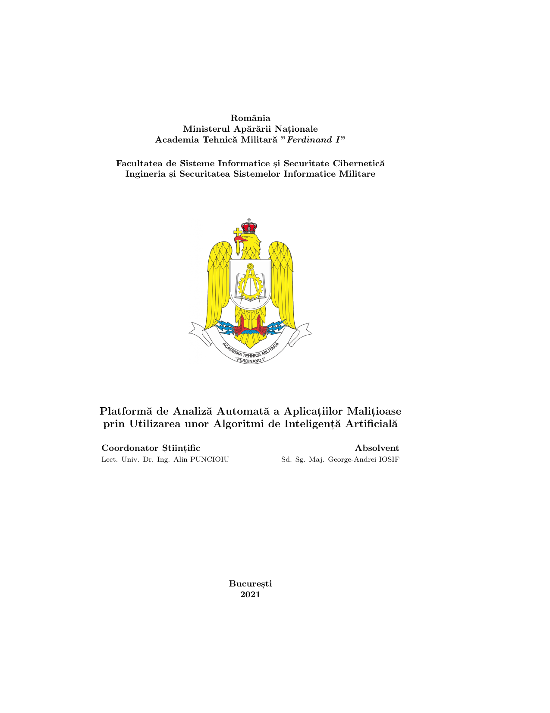

# Bachelor Thesis 📕

## Description 📖

This repository contains documents and sources related to my **Bachelor thesis**, mostly LaTeX source code and StarUML diagrams.

The name of the thesis is "*Platformă de Analiză Automată a Aplicațiilor Malițioase prin Utilizarea unor Algoritmi de Inteligență Artificială*" (in English, "*Platform for Automatic Analysis of Malicious Applications Using Artificial Intelligence Algorithms*") and it was written at Military Technical Academy "*Ferdinand I*" Bucharest. The implementation of the project described inside can be found in a separate repository, [`dike`](https://github.com/iosifache/dike).

The templates that were created and used for these documents can be found in a separate repository, [`MTABachelorThesisTemplates`](https://github.com/iosifache/MTABachelorThesisTemplates).

## Preview 👀

| Thesis                                                                                                       | Presentation                                                                                                                         |
|--------------------------------------------------------------------------------------------------------------|--------------------------------------------------------------------------------------------------------------------------------------|
| <a href="thesis/thesis.pdf"><kbd></kbd></a> | <a href="presentation/presentation.pdf"><kbd></kbd></a> |